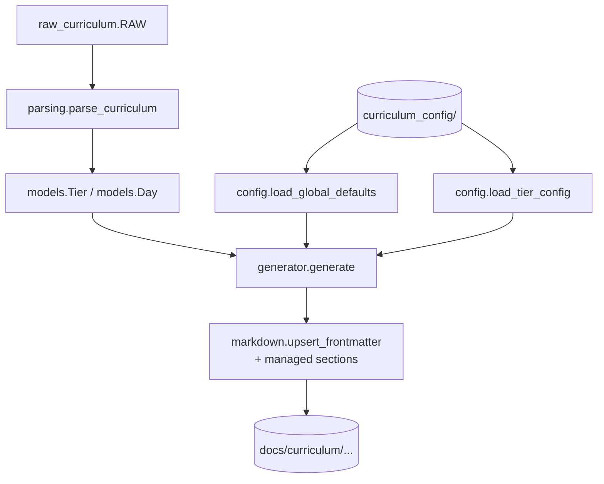
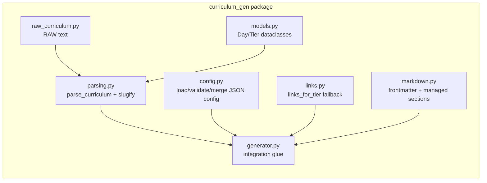
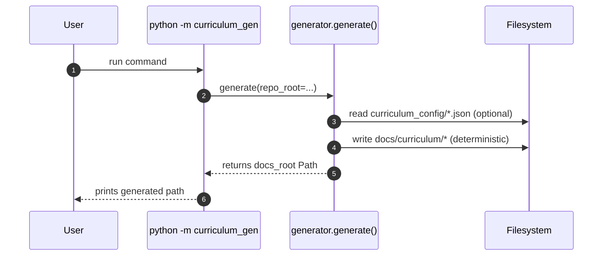

# Architecture

This repo contains a small **curriculum documentation generator**. It takes a canonical curriculum text (RAW), applies optional JSON configuration overrides, and **(re)generates** Markdown pages under `docs/curriculum/` with deterministic frontmatter + managed sections.

---

## High-level flow



**Input sources**
- `curriculum_gen/raw_curriculum.py` — canonical `RAW` curriculum text.
- `curriculum_config/global.json` — optional global defaults.
- `curriculum_config/tier-XX.json` — optional per-tier defaults and per-file overrides.

**Output**
- `docs/curriculum/index.mdx`
- `docs/curriculum/_category_.json`
- `docs/curriculum/tier-XX-<tier-name-slug>/_category_.json`
- `docs/curriculum/tier-XX-<tier-name-slug>/<day-slug>.md`

---

## Module boundaries



**Why this split exists**
- `parsing.py` has *no filesystem access* and is easy to test.
- `config.py` owns the config schema + validation + merge semantics.
- `markdown.py` owns frontmatter and "managed sections" behavior.
- `generator.py` is the only place where the pieces are wired together.

---

## Filesystem contract

The generator expects this repo layout (relative to `repo_root`):

```
repo_root/
  curriculum_config/
    global.json            # optional
    tier-01.json           # optional per tier
    tier-02.json
    ...
  docs/
    curriculum/            # generated output root
```

- Missing config files are treated as empty.
- Output directories are created as needed.

---

## Managed sections policy

The generator **controls only these sections** in each day page:

- `## Task`
- `## Checklist`
- `## Hints`
- `## Docs / Tutorials`

Everything else is preserved, including:
- extra frontmatter keys (custom keys you add)
- additional sections like `## Notes`, `## Examples`, etc.

> You can safely add your own content to pages and regenerate—your content will remain untouched as long as it is not inside a managed section.

---

## Frontmatter policy

Each day page begins with YAML frontmatter:

- `title`
- `sidebar_label`
- `sidebar_position`

These are **upserted deterministically** on every generation run.

Any other frontmatter keys are preserved, e.g.:

```yaml
---
title: "💚 — Print Spell: Hello, World"
sidebar_label: "💚 Print Spell: Hello, World"
sidebar_position: 1
custom: true
---
```

---

## Config schema and merge semantics

### `curriculum_config/global.json`

```json
{
  "defaults": {
    "task": ["..."],
    "checklist": ["..."],
    "hints": ["..."],
    "docs_links": [{"label": "...", "url": "..."}],
    "hints_block": {"enabled": true},

    "task_append": ["..."],
    "checklist_append": ["..."],
    "hints_append": ["..."],
    "docs_links_append": [{"label": "...", "url": "..."}]
  }
}
```

### `curriculum_config/tier-XX.json`

```json
{
  "tier_defaults": { "task": ["..."] },
  "files": {
    "some-day-slug": { "task": ["..."] }
  }
}
```

### Precedence order

1. Global defaults (`global.json.defaults`)
2. Tier defaults (`tier-XX.json.tier_defaults`)
3. File overrides (`tier-XX.json.files[day_slug]`)

### Merge rules

- Dict + dict → deep-merge (recursive)
- Lists → replaced (override wins)
- `*_append` keys → append onto the existing list *in addition to* normal overrides

---

## Docs links fallback behavior

If the effective config includes `docs_links`, it is used.

Otherwise a fallback list is provided by `links_for_tier(tier_n)` (tier-specific curated links).

---

## Validation & failure modes

The generator is intentionally strict:

- Unknown keys in config cause `ValueError`.
- `tier-XX.json.files` cannot include unknown day slugs (helps catch typos).
- Bad JSON causes `ValueError` with filename context.

This strictness is a feature: it prevents silent misconfiguration.

---

## Testing strategy

Tests are organized by behavior (not by implementation detail):

```
tests/
  _util.py            # shared test helpers
  conftest.py         # fixtures: tmp repo + tier index
  test_defaults.py    # global defaults, fallback docs links
  test_precedence.py  # tier overrides global
  test_preserve.py    # manual content preserved, overrides sticky
```

Key invariant tests cover:
- global defaults apply across tiers
- tier defaults override global
- file overrides override both
- regeneration preserves non-managed content and extra frontmatter keys

---

## CLI entrypoint



---

## Design principles (what to keep true)

- **Deterministic output**: re-running generation should not introduce drift.
- **Strict config validation**: typos should fail fast.
- **Non-managed content preservation**: user edits should survive regeneration.
- **Clear boundaries**: parsing/config/markdown/generator separated cleanly.
